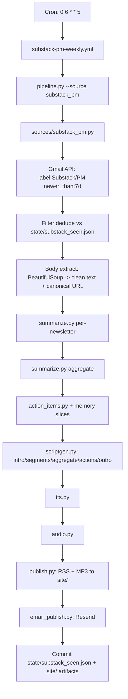
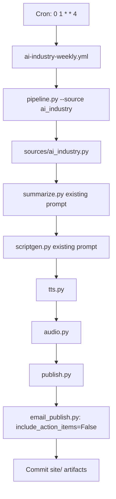

# 01 — Locked Architecture

## Repo layout (after refactor)

```
ai-podcast-generator/
├── .github/workflows/
│   ├── ai-industry-weekly.yml          # RENAME of generate-episode.yml; adds email step
│   └── substack-pm-weekly.yml          # NEW — Friday 06:00 UTC
├── prompts/
│   ├── scriptgen.txt                   # existing — used by ai_industry
│   ├── summarize.txt                   # existing — used by ai_industry
│   ├── scriptgen_substack.txt          # NEW
│   ├── summarize_substack.txt          # NEW
│   ├── aggregate_substack.txt          # NEW
│   ├── action_items.txt                # NEW
│   └── context/                        # NEW — committed memory slices
│       ├── role.md
│       └── projects.md
├── src/
│   ├── config.py                       # MODIFIED — adds SUBSTACK_* constants
│   ├── pipeline.py                     # MODIFIED — adds --source flag, routes plugins
│   ├── sources/                        # NEW dir
│   │   ├── __init__.py                 # defines Source protocol
│   │   ├── ai_industry.py              # NEW — extracted from current ingest.py
│   │   └── substack_pm.py              # NEW — Gmail-based
│   ├── ingest.py                       # KEEP for now as thin shim → ai_industry source
│   ├── diff.py                         # UNCHANGED (used by ai_industry only)
│   ├── summarize.py                    # MODIFIED — selects prompt by source
│   ├── scriptgen.py                    # MODIFIED — selects prompt by source
│   ├── action_items.py                 # NEW
│   ├── email_publish.py                # NEW — Resend integration
│   ├── tts.py                          # UNCHANGED
│   ├── audio.py                        # UNCHANGED
│   └── publish.py                      # UNCHANGED
├── state/
│   └── substack_seen.json              # NEW — committed from substack workflow
├── snapshots/                          # existing — used by ai_industry
└── site/                               # existing — GH Pages output (RSS + MP3s)
```

## High-level data flow





## Components & contracts

### `src/sources/__init__.py` — Source protocol

```python
from typing import Protocol, TypedDict
from datetime import datetime

class ContentItem(TypedDict):
    """Uniform shape returned by every source plugin."""
    id: str                # Stable unique key (gmail msg id, RSS guid, etc.)
    title: str
    url: str               # Canonical post URL (NOT the email URL)
    author: str | None
    published: datetime    # UTC
    body_text: str         # Clean plain text, post body only (no email chrome)
    source_meta: dict      # Plugin-specific extras (publication name, etc.)

class Source(Protocol):
    name: str              # "ai_industry" | "substack_pm"

    def fetch(self, since_days: int = 7) -> list[ContentItem]:
        """Return new items since now-since_days, after dedup."""
```

Both plugins implement `Source`. `pipeline.py` instantiates by `--source` flag and calls `.fetch()`.

### `src/sources/ai_industry.py` — extracted

Wraps the existing `ingest_all()` logic. Maps the existing item shape (`title/url/summary/published/source_name/provider`) into `ContentItem`. `id = sha256(url)`. `body_text = summary` (the existing pipeline doesn't fetch full bodies; this is fine — preserves current behavior).

### `src/sources/substack_pm.py` — new

```python
class SubstackPMSource:
    name = "substack_pm"

    def fetch(self, since_days: int = 7) -> list[ContentItem]:
        # 1. Gmail API: messages.list q="label:Substack/PM newer_than:{since_days}d"
        # 2. For each msg id: messages.get format=full
        # 3. Skip if msg id in state/substack_seen.json
        # 4. Extract HTML body (multipart/alternative, prefer text/html)
        # 5. BeautifulSoup: strip Substack chrome, extract <article> or main content div
        # 6. Find canonical URL (link[rel=canonical] or first substack.com /p/ link)
        # 7. Build ContentItem
        # 8. Append msg id to state file (write happens at pipeline end, not here)
        return items
```

**Body extraction strategy:**
1. Try `link[rel=canonical]` → canonical URL
2. Fallback: first anchor matching `https://*.substack.com/p/*` or `https://*/p/*`
3. Article body: `readability-lxml` first; if that yields <200 chars, fall back to BeautifulSoup `<article>` then largest `<div>` by text length
4. Strip: footers ("Unsubscribe", "Manage subscription"), sharing widgets, image alts, paywall teasers
5. If extraction yields <500 chars, log warning and skip the item (counts toward "skipped" surfaced in email)

### `src/action_items.py` — new

```python
def generate_action_items(
    summaries: list[NewsletterSummary],
    aggregate: AggregateSummary,
    memory_slices: dict,
) -> list[ActionItem]:
    """
    summaries: per-newsletter summary objects from summarize.py
    memory_slices: {"role": str, "projects": str} loaded from prompts/context/
    Returns exactly 3 ActionItem objects.
    """
```

```python
class ActionItem(TypedDict):
    title: str             # Short, imperative ("Audit Port templates against Vercel post")
    description: str       # 1–2 sentences of what to do and why
    source_url: str        # The newsletter URL that prompted this item
    estimated_minutes: int # ≤30
```

Returns exactly 3 items. Validates count + required fields before returning; raises if model output malformed (M3 task adds retry-once logic).

### `src/email_publish.py` — new

```python
def send_episode_email(
    podcast_name: str,
    week_ending: str,
    per_item_summaries: list[NewsletterSummary],
    aggregate: AggregateSummary,
    action_items: list[ActionItem] | None,  # None → block omitted
    episode_url: str,
    recipient: str,
) -> None:
    """Renders Markdown -> HTML and sends via Resend."""
```

- Reads `RESEND_API_KEY` from env
- From: `Fayad's Podcasts <podcasts@<verified-domain>>` (domain TBD — see open Q-1)
- Subject: `[Podcast] {podcast_name} — {week_ending}`
- HTML rendering: Markdown via `markdown` package → minimal inline-styled HTML (no template engine; one f-string)
- On 4xx/5xx from Resend: retry once with 30s backoff, then raise

### `src/pipeline.py` — modified

Add argparse flag:

```python
parser.add_argument("--source", choices=["ai_industry", "substack_pm"], required=True)
```

Routing:

```python
if args.source == "ai_industry":
    source = AIIndustrySource()
    summarize_prompt = "summarize.txt"
    scriptgen_prompt = "scriptgen.txt"
    include_action_items = False
elif args.source == "substack_pm":
    source = SubstackPMSource()
    summarize_prompt = "summarize_substack.txt"
    scriptgen_prompt = "scriptgen_substack.txt"
    include_action_items = True
```

Pipeline stage order (substack_pm path):
1. `items = source.fetch(since_days=7)`
2. If `len(items) == 0`: send "no newsletters" email, exit 0.
3. `per_item = [summarize_one(item, prompt=summarize_prompt) for item in items]`
4. `aggregate = aggregate_summarize(per_item, prompt="aggregate_substack.txt")`
5. `action_items = generate_action_items(per_item, aggregate, load_memory_slices())` (if `include_action_items`)
6. `script = scriptgen(per_item, aggregate, action_items, prompt=scriptgen_prompt)`
7. `audio = tts(script) → audio.stitch()`
8. `episode_url = publish.update_feed(audio)` — for Substack: separate RSS at `site/substack/feed.xml` (so it doesn't mix with the public AI feed); MP3 at `site/substack/episodes/`
9. `email_publish.send_episode_email(...)`
10. `state/substack_seen.json` updated with new message IDs (workflow commits)

### `src/summarize.py` — modified

Currently: one function `summarize(items_grouped_by_provider) → {themes: [...]}`.
Add: `summarize_one(item: ContentItem, prompt_file: str) → NewsletterSummary` for the per-newsletter pass. The existing `summarize()` keeps its signature for the AI Industry path.

```python
class NewsletterSummary(TypedDict):
    title: str
    publication: str       # e.g. "Lenny's Newsletter"
    author: str | None
    url: str
    one_liner: str         # ≤140 char hook
    summary: str           # 4–6 sentences
    key_takeaways: list[str]  # 2–4 bullets
```

### `src/scriptgen.py` — modified

Add a second entry point for the substack structure:

```python
def generate_substack_script(
    per_item: list[NewsletterSummary],
    aggregate: AggregateSummary,
    action_items: list[ActionItem],
) -> str:
    # Loads prompts/scriptgen_substack.txt
    # User message: structured JSON of all inputs
    # Returns dialogue string in same [INTERVIEWER]:/[EXPERT]: format
```

Existing `generate_script(themes)` stays intact for AI Industry.

## State & idempotency

| State | Location | Owner | Update cadence |
|---|---|---|---|
| `state/substack_seen.json` | main branch | substack workflow | Every successful run |
| `snapshots/*.json` | snapshots branch | ai_industry workflow | Every run (existing) |
| `site/feed.xml` | gh-pages (via main) | ai_industry workflow | Every successful run (existing) |
| `site/substack/feed.xml` | main → gh-pages | substack workflow | Every successful run |

## Email contract

Markdown source for both podcasts (action items section conditional):

```markdown
# {{podcast_name}} — week of {{week_ending}}

[Listen to the episode]({{episode_url}})

## This week ({{count}} {{newsletters_or_stories}})

{{#per_item}}
### [{{title}}]({{url}}) — *{{publication_or_provider}}*
{{summary}}
**Key takeaways:** {{key_takeaways_bulleted}}
{{/per_item}}

## The bigger picture
{{aggregate_summary}}

{{#include_action_items}}
## Three things to do this week
1. **{{actions[0].title}}** — {{actions[0].description}} ([source]({{actions[0].source_url}})) · ~{{actions[0].estimated_minutes}} min
2. **{{actions[1].title}}** — ...
3. **{{actions[2].title}}** — ...
{{/include_action_items}}

---
*Generated automatically. {{run_metadata}}*
```

Rendered to HTML inline. No templating engine; f-string with conditional blocks.

## Failure modes & responses

| Failure | Response |
|---|---|
| Gmail API auth fails | Workflow fails; Slack alert to #inbox; no email |
| 0 newsletters returned | Send "no newsletters this week" email; exit 0 |
| Body parse fails for 1 item | Skip that item, log, continue, mention skip count in email |
| Body parse fails for ALL items | Same as 0 newsletters |
| Anthropic API rate-limited | Retry-once with 60s backoff (existing pipeline pattern) |
| Resend send fails | Retry once with 30s backoff; if still fails, fail the workflow (so Slack alert fires) |
| Action items malformed JSON | Retry once with stricter prompt prefix; if still bad, drop the section + email with note |
| TTS quota exceeded | Workflow fails; Slack alert; manual rerun |

## Observability

- Status badges in `README.md` for both workflows.
- Slack webhook on workflow failure: posts to `#inbox` with workflow name + run URL. Secret: `SLACK_WEBHOOK_INBOX`.
- No metrics emission, no dashboards. The email IS the heartbeat — if Fayad doesn't see Friday email, something failed.

## Key non-decisions (for traceability)

- We do NOT cluster Substack newsletters into themes during summarize. Each newsletter is its own segment. Cross-cutting patterns surface in the aggregate stage only.
- We do NOT cap episode length.
- We do NOT push Substack podcast to a public feed. RSS at `site/substack/feed.xml` is private (URL not advertised); MP3 link goes via email only.
